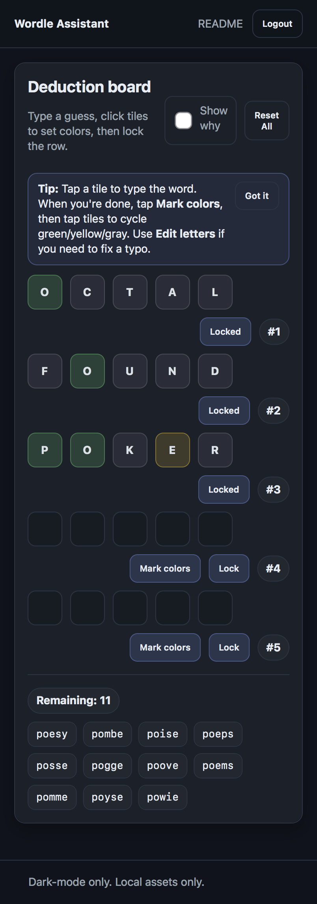
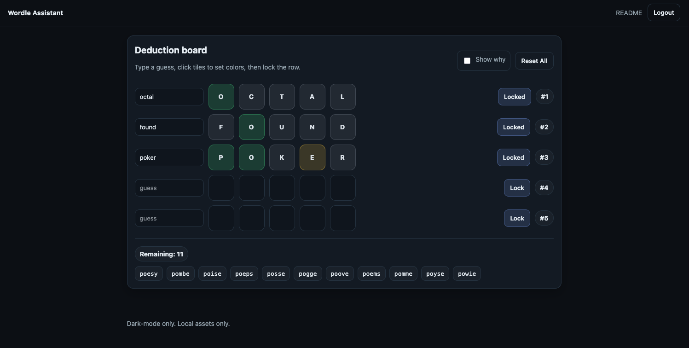
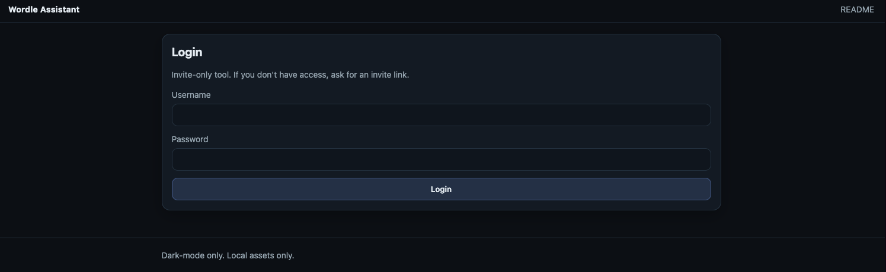
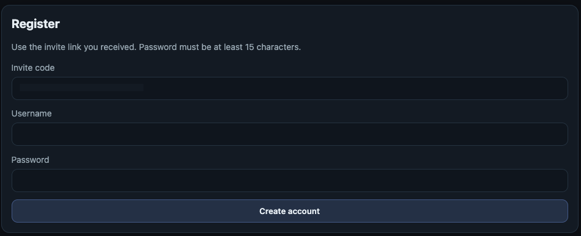

# Wordle Assistant

I had ChatGPT build this for someone that I play Wordle with.

You must have **at least three locked guesses** before suggestions are shown.
(This rule is enforced by the server, not the UI.)

This is a **small, private web app** that helps you **deduce Wordle answers** from a sequence of guesses.

It is deliberately **not** a classic solver where you type constraints once and it spits out words.
Instead, you enter up to **5 guesses** and mark each letter as:

- **Green** — right letter, right place
- **Yellow** — right letter, wrong place
- **Gray** — not in the word

Previously used Wordle answers may also appear, clearly marked and shown separately.

This project is meant to stay **simple and enjoyable** for a couple of years.

---

## Screenshots

### Mobile (primary experience)



### Desktop



_Previously used answers are shown separately when applicable._

### Login



### Registration (invite-only)



---

## How to think about deduction

Wordle deduction is about **constraints**:

- **Green** means: “This position is fixed.”
- **Yellow** means: “This letter exists, but not here.”
- **Gray** means: “This letter doesn’t exist.”  
  (Except with repeated letters — then it may mean _no more of this letter than already confirmed_.)

As you add guesses, you add constraints.  
The list of possible answers shrinks.

If you ever get **zero** possible answers, it usually means:

- A letter color was marked incorrectly, or
- A repeated-letter situation caused a contradiction  
  (for example: one guess implies two L’s, another implies only one)

The app can show a **“why” panel** to help you spot contradictions.

### About previously used answers

As of **February 2026**, the New York Times may occasionally reuse
previously used Wordle answers.

For that reason, this app does **not automatically discard** words
that have appeared before.

Instead:

- Words that have **never been used** are shown as normal candidates
- Words that **have been used previously** are shown separately and
  visually distinct

This keeps the deduction honest while still reflecting current Wordle behavior.

---

## For technical readers: design overview

- **FastAPI + Jinja templates**
- **No CDNs** — all CSS/JS served locally
- **Dark-mode only**
- **Invite-only registration**
- **Argon2** password hashing
- Password length: **≥ 15 characters**
- Anti-brute-force protection:
  - 3 failed attempts per IP → ban for 24 hours
  - Decay rule: counters reset only after a successful login from that IP
  - Banned attempts are logged and uniformly rejected
- Reverse-proxy deployment:
  - App binds to **127.0.0.1** by default
  - Uses `X-Forwarded-For` only if the request comes from a trusted proxy IP

---

## Data sources

This project caches two local files under `data/`:

- `allowed_words.txt` — allowed 5-letter guesses list  
  (downloaded via `cli.py words-sync`)
- `used_words.json` — used Wordle answers list  
  (downloaded via `cli.py used-sync`, shown separately when relevant)

The app **does not scrape websites at runtime**.

---

## Setup (local)

### 1) Create venv and install dependencies (uv)

```bash
uv venv
uv sync
```

2. Initialize word lists

Download the allowed guesses list:

```bash
uv run python cli.py words-sync
```

Fetch the used answers list (through yesterday):

```bash
uv run python cli.py used-sync
```

⸻

3. Create an invite (CLI)

Set a base URL for the invite link you’ll text or email:

```bash
export BASE_URL="https://wordle.example.com"
uv run python cli.py invite-create --username "someone"
```

This prints a link like:

```code
https://wordle.example.com/register?code=XXXX-XXXX-XXXX
```

⸻

4. Run the app locally

```bash
export APP_SECRET_KEY="change-me-long-random"
export TRUSTED_PROXY_IPS="127.0.0.1"   # set to your reverse proxy IP(s) in prod

uv run uvicorn app:app --host 127.0.0.1 --port 8000
```

⸻

Cron jobs

Used-word updates are cron-only.

Daily sync:

```cron
0 6 * * * cd /path/to/wordle-assistant && /usr/bin/env -i \
  PATH=/usr/bin:/bin \
  BASE_URL="https://wordle.example.com" \
  uv run python cli.py used-sync >> data/cron.log 2>&1
```

Optional monthly refresh of allowed words (rarely changes):

```cron
0 5 1 * * * cd /path/to/wordle-assistant && \
  uv run python cli.py words-sync >> data/cron.log 2>&1
```

⸻

Why solvers can be wrong (teachable moment)

1. Repeated letters: A single wrong color choice can “prove” there are two of a letter when there is only one.
2. Human mistakes: One incorrect click can make the puzzle impossible. The contradiction panel helps you find these.
3. Word list differences: Different solvers use different word lists.

This app uses locally cached, explicit lists.

⸻

Quick use

1.  Log in.
2.  Enter a guess.
3.  Tap each tile to set its color (unknown → green → yellow → gray). 4
4.  Click Lock for that row.
5.  Repeat (up to 5 guesses).
6.  Click Reset All to start over.

Use the “Show why” toggle if you hit a contradiction.
